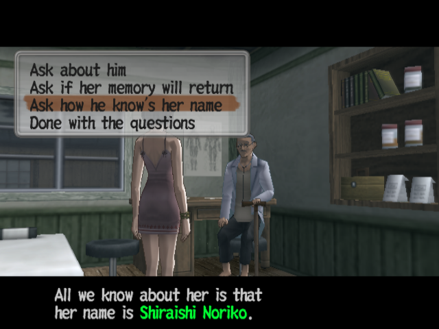
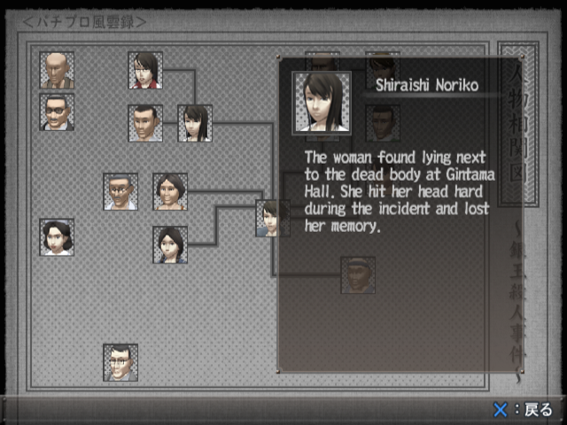
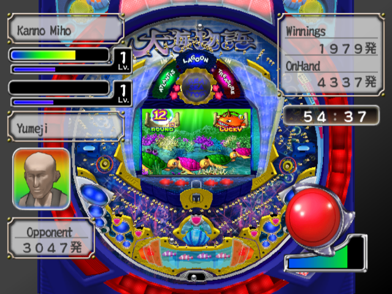
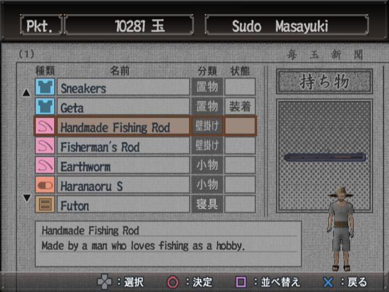
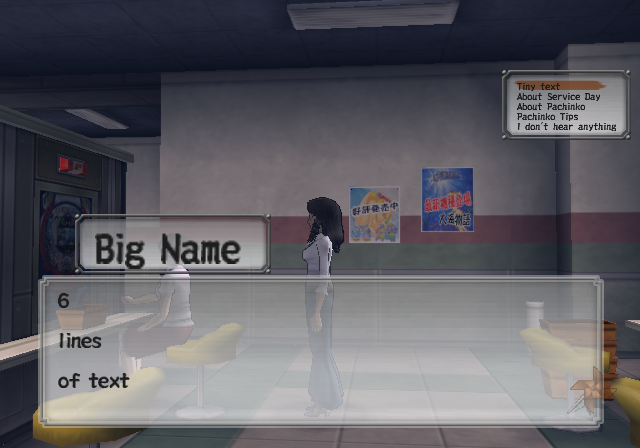

# PachiPara-12-English-Translation
An English translation project for Irem's PS2 game PachiPara 12. \
 \
Currently looking for help with translation from Japanese to English. \
If you interested please contact me on discord: scatterdbrain. \
See here for more info [romhacking.net](https://www.romhacking.net/forum/index.php?topic=40213.0) \
 \
Tools used: \
[QuickBMS](https://aluigi.altervista.org/quickbms.htm) - unpacking of .DAT files with disaster_report.bms script. \

